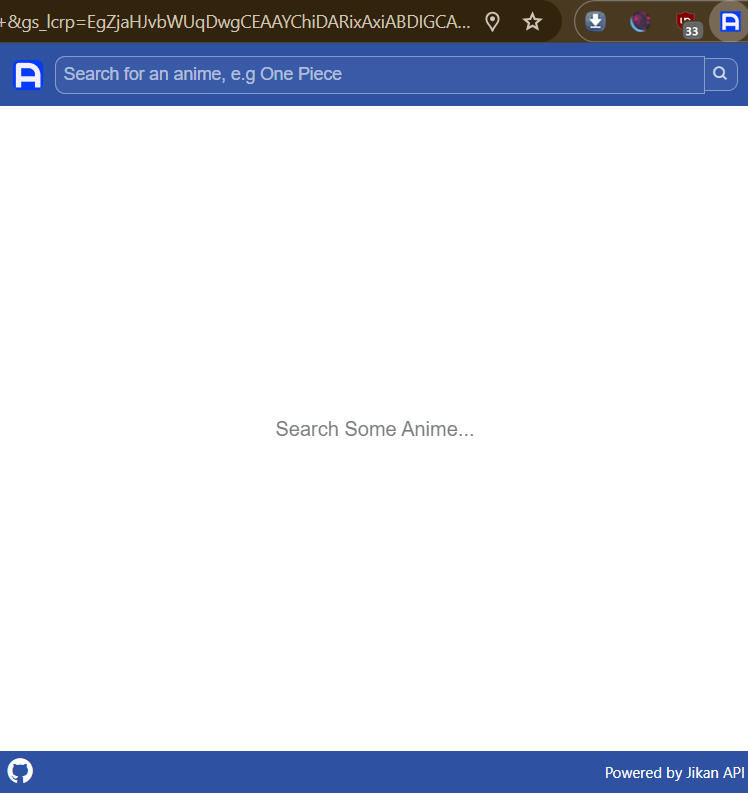

# AniSearch

Simple Browser Extension which Fetches Anime Info from MyAnimeList using Jikan API.

## Getting Started

These instructions will help you get a copy of the project up and running on your local machine for development purposes.

To install and run this extension: 

1. You will need a browser like Chrome/Edge/FireFox/etc.

2. Clone the Repository:
```bash
git clone https://github.com/AyushJain25522/AniSearch.git
```

3. Load the Extension:
- For Chrome and Chromium-based browsers open the Extension Management page by clicking on the menu (three vertical dots), hovering over **Extensions** then selecting **Manage Extensions**.
- For Firefox, navigate to **about:addons** and choose **Extensions**.
- For Opera, open the Extensions page by clicking on the **Opera menu** (O icon), selecting **Extensions**, and then **Extensions** again.

4. Enable Developer Mode:

- Toggle the switch next to **Developer mode** (for Chrome and Chromium-based browsers) or **Developer** (for Opera).

5. Click the LOAD UNPACKED Button:

- Click the **LOAD UNPACKED** button and select the `src` directory inside `AniSearch` where 'index.html' and 'manifest.json' are located.

6. That's all: The extension should now be installed. If not, you may see an error. 
- Click on the extension icon to use it.
- It should look like this:-



## Acknowledgement

The idea for this project was inspired by [anime-lookup](https://github.com/kaushalmeena/anime-lookup). I removed all bugs and further improved it with new features.

## License

This project is licensed under the MIT License - see the [LICENSE](LICENSE) file for details. It is free to use, copy, and modify.
